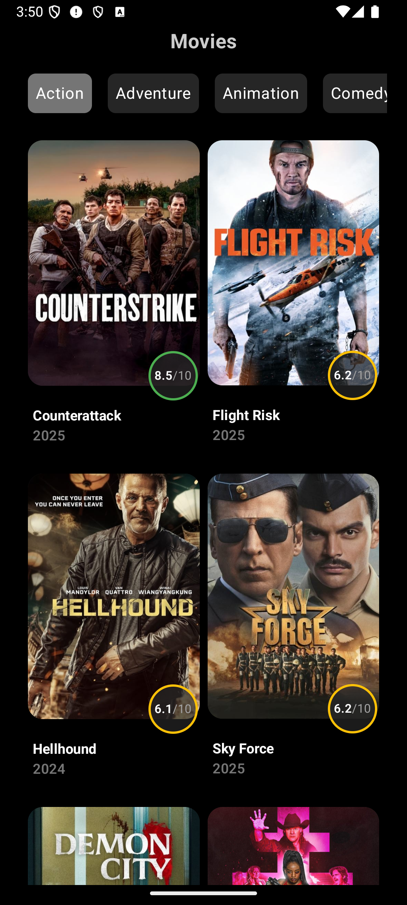
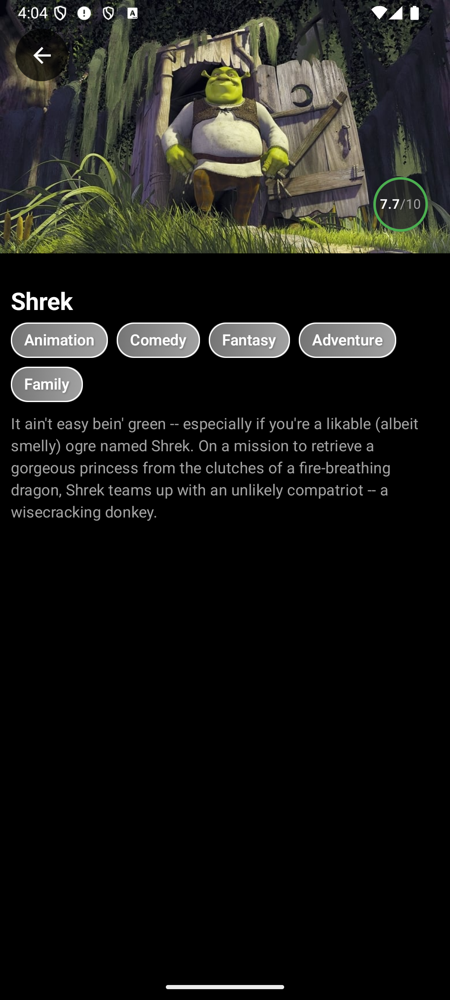

# 🎬 Movies App

A beautiful Jetpack Compose app to browse and search for movies using the TMDb API.

## 📸 Screenshots
<p align="center">
    
  
</p>

## 🚀 Technologies Used
- **Kotlin** 🟡
- **Jetpack Compose** 🖌️
- **MVVM Architecture** 🏗️
- **Retrofit** 🌐
- **Hilt (Dependency Injection)** 🔧
- **Coroutines & Flow** ⚡
- **TMDb API** 🎞️

## 🔗 API Reference
This app fetches movie data from [The Movie Database (TMDb)](https://www.themoviedb.org/).

## 📌 Features
✅ Browse trending movies  
✅ View detailed movie info  
✅ Responsive UI with Jetpack Compose  

## 📥 Installation
1. Clone the repository  
   ```sh
   git clone https://github.com/yourusername/MoviesApp.git
